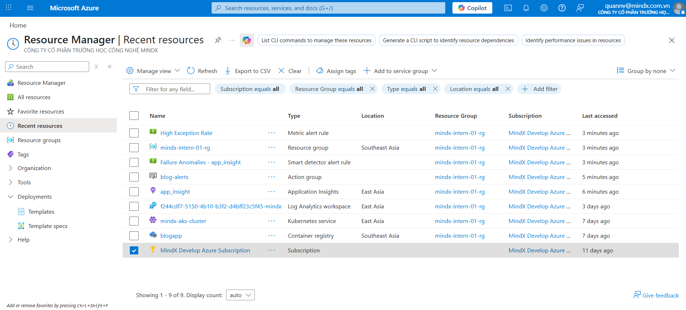
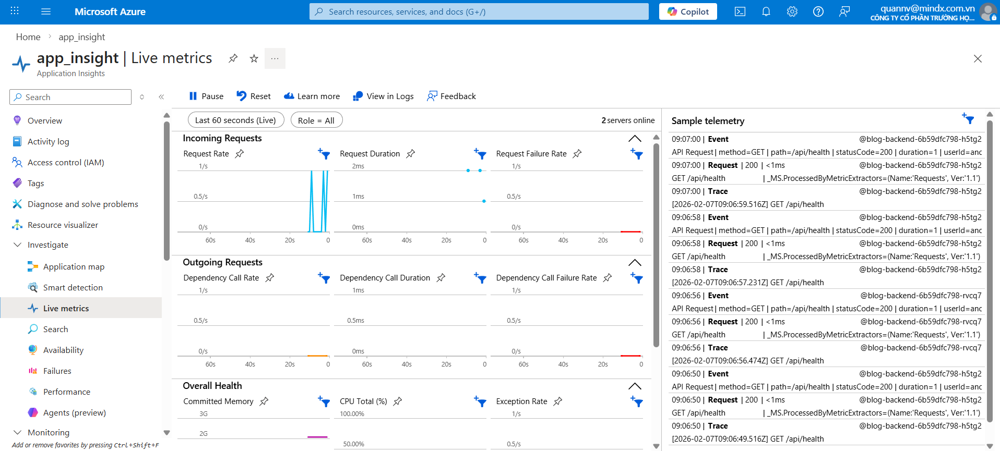
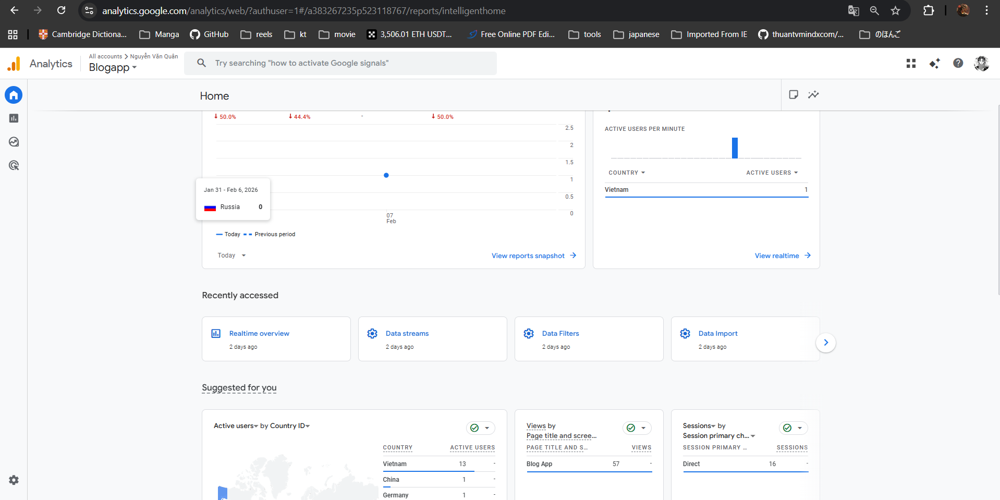
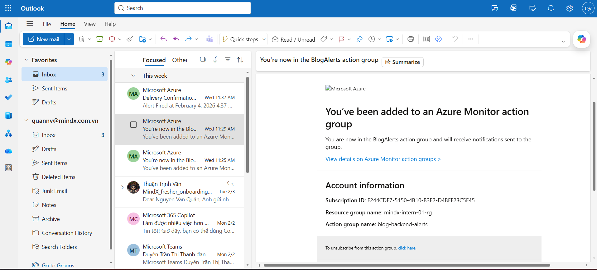
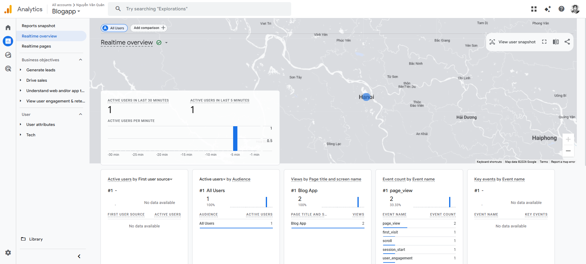
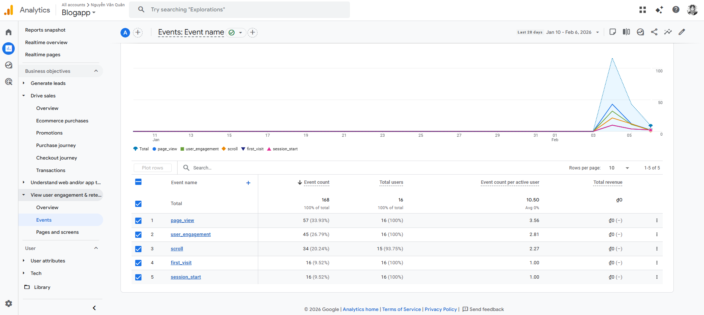

# Blog Application - Week 2: Production and Product Metrics setup

**Project Overview:** Implement production and product metrics for the blog application using Azure Application Insights and Google Analytics 4.

**Live Application:** https://quannv.id.vn

---

## Overview

This week focuses on implementing comprehensive monitoring and analytics for both production infrastructure (Azure Application Insights) and product usage (Google Analytics 4).

The application implements two complementary monitoring systems:
- **Azure Application Insights**: Production infrastructure and performance monitoring
- **Google Analytics 4**: Product analytics and user behavior tracking

**📊 Quick Access to Metrics**:
- **Azure Portal**: https://portal.azure.com → Search "Application Insights"
- **Google Analytics**: https://analytics.google.com → Property: G-RZ3H15V2B1
- **Detailed Access Instructions**: See [How to Access Metrics](#how-to-access-metrics) section

---

## Production and Product Metrics setup

### Architecture

```
┌─────────────────────────────────────────────────────────────┐
│                     Blog Application                        │
│                                                             │
│  ┌─────────────────┐              ┌─────────────────┐       │
│  │    Frontend     │              │     Backend     │       │
│  │   React App     │              │   Express API   │       │
│  │                 │              │                 │       │
│  │  ┌──────────┐   │              │  ┌──────────┐   │       │
│  │  │ Google   │   │              │  │   App    │   │       │
│  │  │Analytics │   │              │  │ Insights │   │       │
│  │  │   (GA4)  │   │              │  │   SDK    │   │       │
│  │  └────┬─────┘   │              │  └────┬─────┘   │       │
│  └───────┼─────────┘              └───────┼─────────┘       │
│          │                                │                 │
└──────────┼────────────────────────────────┼─────────────────┘
           │                                │
           │                                │
           ▼                                ▼
  ┌────────────────┐              ┌────────────────────┐
  │  Google        │              │  Azure Application │
  │  Analytics 4   │              │     Insights       │
  │                │              │                    │
  │ • Page Views   │              │ • API Metrics      │
  │ • Events       │              │ • Performance      │
  │ • Sessions     │              │ • Errors/Logs      │
  │ • User Flow    │              │ • Dependencies     │
  └────────────────┘              │ • Alerts           │
                                  └────────────────────┘
```

---

###  Azure Application Insights Setup

**Purpose**: Monitor backend API performance, errors, dependencies, and custom metrics.

#### Install Application Insights SDK

```bash
cd backend
npm install applicationinsights@^2.9.6
```

**Important**: Use v2.9.6 instead of v3.x to avoid OpenTelemetry crypto module issues in Alpine containers.

#### Backend Integration

Create `backend/appInsights.js`:

```javascript
const appInsights = require('applicationinsights');

function initializeAppInsights() {
  const connectionString = process.env.APPLICATIONINSIGHTS_CONNECTION_STRING;
  
  if (!connectionString) {
    console.warn('Application Insights connection string not found');
    return null;
  }

  appInsights.setup(connectionString)
    .setAutoCollectRequests(true)
    .setAutoCollectPerformance(true)
    .setAutoCollectExceptions(true)
    .setAutoCollectDependencies(true)
    .setAutoCollectConsole(true)
    .start();

  console.log('Application Insights initialized');
  return appInsights.defaultClient;
}

module.exports = { initializeAppInsights };
```

Update `backend/server.js`:

```javascript
const { initializeAppInsights } = require('./appInsights');
const appInsightsClient = initializeAppInsights();

// Custom metrics tracking
if (appInsightsClient) {
  app.use((req, res, next) => {
    const startTime = Date.now();
    res.on('finish', () => {
      const duration = Date.now() - startTime;
      appInsightsClient.trackMetric({
        name: 'RequestDuration',
        value: duration
      });
    });
    next();
  });
}
```
#### 8.2.3 Deploy and Verify

```bash
# Rebuild and push backend
docker build -t blogapp.azurecr.io/blogapp-backend:latest ./backend
docker push blogapp.azurecr.io/blogapp-backend:latest

# Restart deployment
kubectl rollout restart deployment blog-backend

# Check logs
kubectl logs -l app=blog-backend --tail=50 | grep "Application Insights"
```

**Expected Output**:
```
Application Insights initialized
```

---

###  Google Analytics 4 Setup

**Purpose**: Track user interactions, page views, and product metrics.

#### Create GA4 Property

1. Go to [Google Analytics](https://analytics.google.com)
2. Create new GA4 property
3. Get Measurement ID (format: `G-XXXXXXXXXX`)

#### Frontend Integration

Add gtag.js snippet to `blog-frontend/public/index.html`:

```html
<!DOCTYPE html>
<html lang="en">
  <head>
    <!-- Google tag (gtag.js) -->
    <script async src="https://www.googletagmanager.com/gtag/js?id=G-RZ3H15V2B1"></script>
    <script>
      window.dataLayer = window.dataLayer || [];
      function gtag(){dataLayer.push(arguments);}
      gtag('js', new Date());
      gtag('config', 'G-RZ3H15V2B1');
    </script>
    
    <meta charset="utf-8" />
    <!-- rest of head -->
  </head>
  <!-- rest of HTML -->
</html>
```

#### Install React GA4 Package

```bash
cd blog-frontend
npm install react-ga4
```

Create `.env` file:

```
REACT_APP_GA_TRACKING_ID=G-RZ3H15V2B1
```

#### Create Analytics Service

Create `blog-frontend/src/services/analytics.js`:

```javascript
import ReactGA from 'react-ga4';

export const initGA = () => {
  const trackingId = process.env.REACT_APP_GA_TRACKING_ID;
  if (trackingId) {
    ReactGA.initialize(trackingId);
    console.log('Google Analytics initialized with ID:', trackingId);
  } else {
    console.warn('GA tracking ID not found');
  }
};

```

#### Integrate in React App

Update `blog-frontend/src/App.js`:

```javascript
import { initGA, trackPageView, trackEvent } from './services/analytics';
import { useEffect } from 'react';

function App() {
  useEffect(() => {
    initGA();
    trackPageView(window.location.pathname);
  }, []);

  // Track post views
  const handlePostClick = (post) => {
    trackEvent('Post', 'View', post.title, post.id);
    setSelectedPost(post);
  };

  // Rest of component...
}
```

#### Deploy Updated Frontend

```bash
# Rebuild with analytics
docker build -t blogapp.azurecr.io/blogapp-frontend:latest ./blog-frontend
docker push blogapp.azurecr.io/blogapp-frontend:latest

# Restart deployment
kubectl rollout restart deployment blog-frontend
```

---

### Accessing Metrics

This section provides direct access links and navigation instructions for both Azure Application Insights and Google Analytics 4.

#### Application Insights (Production Metrics)

**Direct Access Links:**
- **Azure Portal**: https://portal.azure.com/
- Access Dashboard, choose Application Insights and create.



**Key Views**:

1. **Live Metrics**: Real-time monitoring
   - Navigate to: `Live Metrics`
   - View: Incoming requests, dependencies, exceptions
   - Use for: Live debugging, deployment verification
   

2. **Performance**: Request duration and throughput
   - Navigate to: `Investigate > Performance`
   - View: Operation duration, dependency calls
   - Filter by: Time range, operation name
   

3. **Failures**: Errors and exceptions
   - Navigate to: `Investigate > Failures`
   - View: Exception types, failed requests
   - Drill into: Stack traces, request details
   

4. **Alert** : Alerts are configured in Azure Portal
    - Exception rate > threshold
    - Response time > threshold
    - Failed requests > threshold
    

#### Google Analytics 4 (Product Metrics)

**Direct Access Links:**
- **Google Analyst** : https://analytics.google.com/analytics/web/
- **Direct Property Access**: https://analytics.google.com/analytics/web/?authuser=1#/a383267235p523118767/reports/intelligenthome
- **My Property ID**: G-RZ3H15V2B1

**Key Reports**:

1. **Realtime**: Current active users
   - Navigate to: `Reports > Realtime`
   - View: Active users, events, page views
   - Use for: Deployment verification, live testing
   

2. **Engagement**: User interactions
   - Navigate to: `Reports > Engagement > Events`
   - View: Event count, users, conversions
   


---


### Testing and Verification

**Azure Application Insights:**
- [ ] Backend logs appear in Live Metrics
- [ ] Request telemetry is collected
- [ ] Custom metrics (RequestDuration) are visible
- [ ] Alerts are configured and functioning


**Google Analytics:**
- [ ] Page views are tracked
- [ ] Custom events appear in Realtime report
- [ ] User properties are set correctly
- [ ] Event parameters are captured
- [ ] Sessions and user counts are accurate


---

