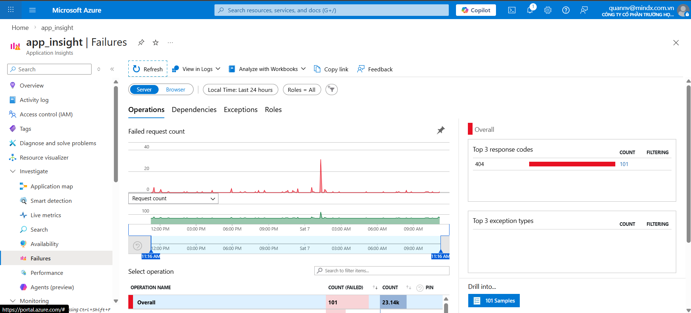

# WEEK 4 FINAL REPORT: REPORTING, ANALYSIS & PROBLEM RESOLUTION

## 1. Executive Summary

Week 4 focused on using Odoo reporting to identify recurring support issues, measure helpdesk performance, and define a practical improvement roadmap based on data.

Before analysis, the raw source file (`sample.xlsx`) was cleaned to ensure reliability: all records without a "Subject" value were removed. After preprocessing, **149 valid tickets** were imported into Odoo Helpdesk and used as the official dataset for dashboard tracking, root-cause analysis, and action planning.

## 2. Dashboard Metrics & Data Evidence

**Live Odoo Dashboard URL:** [https://quannv.odoo.com/odoo/dashboards?dashboard_id=1](https://quannv.odoo.com/odoo/dashboards?dashboard_id=1)

### 2.1 Workload Distribution & Performance Overview

- **Total Valid Tickets Analyzed:** 149
- **Workload Concentration:** Dashboard metrics show that **100% (149/149)** of ticket volume is routed to the Technical Support team. This concentration indicates systemic operational friction rather than isolated user errors.
- **Resolution Velocity:** Although many tickets reached the "Resolved" stage, the absolute volume of 149 tickets in the reporting window still indicates an unsustainable operational pace that requires structural optimization.

### 2.2 Category Analysis 

By grouping the 149 tickets by Tags (Category), repeated system-failure patterns became clear. Two ecosystems dominate the queue:

- **CRM Ecosystem:** 23 tickets
- **LMS Ecosystem:** 21 tickets

These leading categories account for a significant share of the technical workload, and targeting them will provide the highest Return on Investment (ROI) for ticket-volume reduction.

## 3. Root Cause Analysis (Top 2 Recurring Issues)

Following the requirement to analyze top recurring issues, this RCA breaks down the technical origins of the CRM and LMS failures.

### Issue 1: CRM Provisioning & Synchronization Timeout (23 Tickets)

**Description & Impact:** After payment, student profiles frequently fail to auto-generate in CRM. This delays onboarding and forces Technical Support to manually handle account creation and invoice reconciliation.

**Technical Root Cause:** Analysis points to **Webhook Timeout** desynchronization between the payment gateway and the CRM API instance. During traffic spikes, the CRM endpoint returns `504 Gateway Timeout`, while the current architecture lacks retry or dead-letter queue handling for dropped HTTP POST payloads.

**Solution & Mitigation:**
- **Idempotent Ingestion Layer:** Refactor the CRM webhook handler so repeated callbacks with the same transaction key are safely deduplicated.
- **Progressive Retry Policy:** Implement exponential backoff retries (e.g., 5s, 15s, 60s) for transient delivery failures to improve callback completion rate.
- **Failure Isolation Path:** Add dead-letter queue routing for exhausted retries, enabling controlled replay and faster incident recovery without data loss.

### Issue 2: LMS Duplicate Account Creation (21 Tickets)

**Description & Impact:** A single registration can create two or more identical profiles in the LMS PostgreSQL database, fragmenting learning progress and inflating data tables.

**Technical Root Cause:** The React/Vue frontend lacks robust **request debouncing**. Under short network delays, users often double-click submit, sending duplicate POST requests before the first database lock is effectively applied.

**Solution & Mitigation:**
- **Backend Idempotency Guard:** Introduce request-level locking with a short-lived Redis key (e.g., by `UserID/SessionID`) so repeated submissions in the same window are ignored.
- **Database Integrity Control:** Enforce a composite unique constraint on `(Email, TransactionID)` to reject duplicate inserts at persistence level.
- **Frontend Submission Protection:** Convert the submit action to single-click mode by disabling the button immediately after the first click and showing a loading indicator until completion.

## 4. Improvement Proposals & Action Plan

To reduce ticket volume and relieve the current 100% support load on Technical Support, the following phased rollout is recommended.

### 4.1 Short-Term Execution (Next 7 Days)

- **Ticket Intake Standardization:** Enforce a required `Tags/Category` field at submission time so every ticket enters the queue with clear triage metadata.
- **Rapid LMS Registration Patch:** Release a frontend guardrail in the registration form (single-submit lock + loading state) to stop accidental duplicate account requests.

### 4.2 Long-Term System Upgrades (Next 30 Days)

- **CRM Reliability Program:** Execute a two-sprint roadmap focused on webhook durability, including retry orchestration and failure-handling hardening for CRM integrations.
- **Operational KPI Target:** Once CRM timeout and LMS duplication issues are stabilized, monthly helpdesk demand is projected to decline by at least **30%**, allowing Support to shift effort from repetitive incidents to preventive maintenance.
