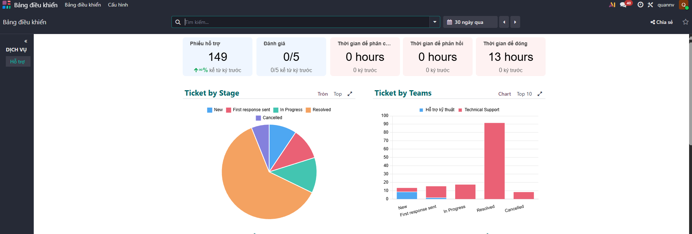
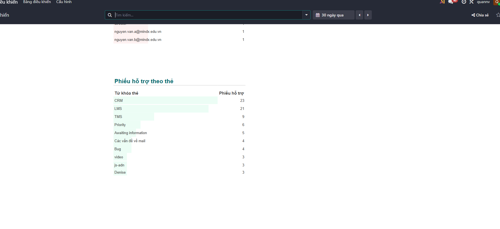

# WEEK 4 FINAL REPORT: REPORTING, ANALYSIS & PROBLEM RESOLUTION

---

## 1. Executive Summary

Week 4 focused on using Odoo reporting to identify recurring support issues, measure helpdesk performance, and define a practical improvement roadmap based on data.

Before analysis, the raw source file (`sample.xlsx`) was cleaned to ensure reliability: all records without a "Subject" value were removed. After preprocessing, **149 valid tickets** were imported into Odoo Helpdesk and used as the official dataset for dashboard tracking, root-cause analysis, and action planning.

---

## 2. Dashboard Metrics & Data Evidence

**Live Odoo Dashboard:** [https://quannv.odoo.com/odoo/dashboards?dashboard_id=1](https://quannv.odoo.com/odoo/dashboards?dashboard_id=1)

### 2.1 Workload Distribution & Performance Overview

| Metric | Value |
|---|---|
| Total Valid Tickets Analyzed | **149** |
| Team Routing Concentration | **100% routed to Technical Support (149/149)** |
| Top Category by Volume | **CRM Ecosystem — 23 tickets** |
| 2nd Category by Volume | **LMS Ecosystem — 21 tickets** |
| Combined Share of Top 2 Categories | **29.5% of total queue (44 / 149 tickets)** |

The 100% Technical Support routing concentration indicates systemic operational friction rather than isolated user errors. The absolute volume of 149 tickets in the reporting window signals an unsustainable operational pace requiring structural optimization.

### 2.2 Category Analysis — Ranked by Ticket Volume

| Rank | Category / Ecosystem | Tickets | % of Total | Primary Impact |
|:---:|---|:---:|:---:|---|
| **#1** | CRM Ecosystem | **23** | 15.4% | Student onboarding failures post-payment |
| **#2** | LMS Ecosystem | **21** | 14.1% | Duplicate profiles fragmenting learning data |
| #3+ | Other Categories | 105 | 70.5% | Distributed across remaining modules |

---

## 3. Root Cause Analysis — Top 2 Recurring Issues

Issues are ranked by ticket volume and analyzed to three levels of depth: **Module → Sub-feature → Root Bug**. Each issue is rated for Severity and Implementation Effort to prioritize remediation.

---

### ISSUE #1 · CRM Provisioning & Synchronization Timeout · 23 Tickets · SEVERITY: CRITICAL

#### 3.1.A Feature Depth Analysis — 3-Level Breakdown

| Level | Component | Detail |
|---|---|---|
| **L1 — Module** | CRM Integration Layer | Automated student profile provisioning after payment gateway confirmation |
| **L2 — Sub-feature** | Payment Gateway → CRM Webhook Delivery | HTTP POST callback from payment processor to CRM API endpoint on transaction completion |
| **L3 — Root Bug** | Webhook Timeout + No Retry / Dead-Letter Queue | During traffic spikes, CRM endpoint returns `504 Gateway Timeout`. Architecture lacks retry logic and dead-letter queue, causing permanent payload loss with no recovery path. |

#### 3.1.B Severity & Impact Assessment

| Severity | Ticket Volume | User Impact | Business Impact |
|---|:---:|---|---|
| **CRITICAL** | 23 (15.4%) | Paid students cannot access service immediately after purchase | Manual intervention required per ticket; invoice reconciliation delays; high churn risk for new students |

#### 3.1.C Proposed Solutions

| Fix | Technical Approach | Expected Outcome |
|---|---|---|
| **Idempotent Ingestion Layer** | Refactor webhook handler to deduplicate repeated callbacks using transaction key | Zero duplicate profile creation from retried webhooks |
| **Progressive Retry Policy** | Exponential backoff: 5s → 15s → 60s for transient delivery failures | Callback completion rate target: ≥95% within 3 attempts |
| **Dead-Letter Queue Routing** | Route exhausted retries to DLQ for manual replay without data loss | Incident recovery time reduced from hours to <15 min via controlled replay |

---

### ISSUE #2 · LMS Duplicate Account Creation · 21 Tickets · SEVERITY: HIGH

#### 3.2.A Feature Depth Analysis — 3-Level Breakdown

| Level | Component | Detail |
|---|---|---|
| **L1 — Module** | LMS User Registration Module | New student account creation flow from registration form submission to profile persistence |
| **L2 — Sub-feature** | React/Vue Frontend Submit Handler → PostgreSQL INSERT | Single-click registration form submits POST request; backend writes new user row to PostgreSQL without uniqueness enforcement |
| **L3 — Root Bug** | Missing Request Debouncing + No DB Unique Constraint | Under short network delays, users double-click submit sending duplicate POSTs before DB lock applies. No composite unique constraint on `(Email, TransactionID)` to reject duplicates at persistence level. |

#### 3.2.B Severity & Impact Assessment

| Severity | Ticket Volume | User Impact | Business Impact |
|---|:---:|---|---|
| **HIGH** | 21 (14.1%) | Fragmented learning progress across duplicate profiles | Inflated PostgreSQL user table; manual deduplication effort per ticket; corrupted progress reporting in LMS analytics |

#### 3.2.C Proposed Solutions

| Fix | Technical Approach | Expected Outcome |
|---|---|---|
| **Backend Idempotency Guard** | Request-level Redis lock keyed on `UserID/SessionID` with TTL=5s | Duplicate submissions within 5s window silently dropped; zero DB duplicates from same session |
| **Database Integrity Constraint** | Composite `UNIQUE` index on `(Email, TransactionID)` in PostgreSQL users table | Hard reject any duplicate INSERT at DB level; zero duplicate rows regardless of upstream logic |
| **Frontend Submission Lock** | Disable submit button on first click; show loading spinner until server response received | Eliminates user-side double-click; reduces duplicate POST attempts by est. 80%+ |

---

## 4. Improvement Proposals & Action Plan

Each action item includes a specific Owner, Deadline, and measurable Success Metric (KPI) so progress can be tracked objectively in the Odoo dashboard at the end of each phase.

### 4.1 Short-Term Execution — Next 7 Days

| # | Action Item | Owner | Deadline | Success Metric (KPI) |
|:---:|---|---|:---:|---|
| 1 | Enforce mandatory Tags/Category field at ticket submission in Odoo | Helpdesk Admin | Day 3 | 100% of new tickets contain a valid Category tag; 0 untagged tickets in Odoo queue within 48h of deployment |
| 2 | Release LMS frontend submission lock (disable button + loading spinner on first click) | Frontend Dev | Day 5 | LMS duplicate-account tickets ≥50% reduction week-over-week; frontend duplicate POST error rate drops to <2% |
| 3 | Add PostgreSQL UNIQUE constraint on `(Email, TransactionID)` in LMS users table | Backend Dev / DBA | Day 7 | Zero new duplicate user rows in DB post-deployment; verified via daily `SELECT COUNT(*)` deduplication audit query |

### 4.2 Long-Term System Upgrades — Next 30 Days

| # | Action Item | Owner | Deadline | Success Metric (KPI) |
|:---:|---|---|:---:|---|
| 4 | Implement CRM webhook exponential backoff retry (5s → 15s → 60s) with DLQ routing | Backend / Infra | Day 14 | Webhook callback success rate ≥95% on first 3 attempts; DLQ message count <5/day in steady state; CRM 504 error rate <1% |
| 5 | Deploy Redis idempotency guard on CRM webhook handler (deduplicate by TransactionID) | Backend Dev | Day 18 | Zero duplicate CRM profiles from retried webhooks; idempotency key TTL=24h; verified via automated integration test suite |
| 6 | Set up real-time Odoo SLA dashboard with automated weekly KPI digest to team | Helpdesk Lead | Day 25 | SLA compliance rate ≥90% for P1 tickets (resolve within 4h); dashboard live and reviewed in weekly stand-up |
| 7 | 30-Day Post-Fix Review: measure total helpdesk demand reduction across CRM + LMS categories | PM + Helpdesk Lead | Day 30 | CRM + LMS combined ticket volume ≤14/month (from 44); overall monthly ticket volume reduction ≥30%; MTTR for P1 tickets <2h |

### 4.3 KPI Summary Dashboard

| KPI | Baseline (Week 4) | Target (Day 30) | Measurement Method |
|---|:---:|:---:|---|
| Total monthly tickets | 149 | **≤ 104 (−30%)** | Odoo Helpdesk report — monthly count |
| CRM category tickets/month | 23 | **≤ 8 (−65%)** | Odoo tag filter: CRM Ecosystem |
| LMS category tickets/month | 21 | **≤ 6 (−70%)** | Odoo tag filter: LMS Ecosystem |
| Webhook callback success rate | ~70% (est.) | **≥ 95%** | Server logs / webhook delivery monitor |
| Duplicate LMS accounts/week | ~5 (est.) | **0** | Daily DB deduplication audit query |
| P1 SLA compliance (resolve ≤4h) | Not tracked | **≥ 90%** | Odoo SLA dashboard (Day 25 setup) |
| MTTR for P1 tickets | Not tracked | **< 2 hours** | Odoo ticket open-to-resolve timestamp diff |
| Ticket tagging rate | Partial | **100%** | Odoo field completeness report on Tags column |

---

